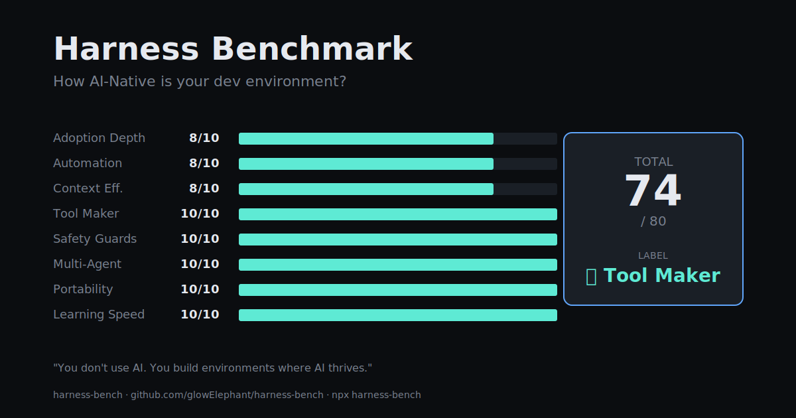

# harness-bench

[](https://www.npmjs.com/package/harness-bench)
[](LICENSE)
[](https://nodejs.org)

> **How AI-Native is your dev environment?**
> A CLI that benchmarks your Claude Code harness across 8 axes — in under 5 seconds, with zero data leaving your machine.

```bash
npx harness-bench
```

<p align="center">
  
</p>

<details>
<summary>Terminal output preview</summary>

```
━━━━━━━━━━━━━━━━━━━━━━━━━━━━━━━━━━━━━━━━━━━━━━━━━━━━━━
  Harness Benchmark                                v0.2.0
━━━━━━━━━━━━━━━━━━━━━━━━━━━━━━━━━━━━━━━━━━━━━━━━━━━━━━

  Adoption Depth   ████████░░░░░░  6/10
  Automation       ███████████░░░  8/10
  Context Eff.     ████████░░░░░░  6/10
  Tool Maker       ██████████████ 10/10
  Safety Guards    ██████████████ 10/10
  Multi-Agent      ██████████████ 10/10
  Portability      ██████████████ 10/10
  Learning Speed   ██████████████ 10/10

──────────────────────────────────────────────────────
  TOTAL            72 / 80
  LABEL            🛠  Tool Maker

  You don't use AI. You build environments where AI thrives.
──────────────────────────────────────────────────────
```

</details>

---

## Why this exists

Every Claude Code user has a setup — some hooks here, an MCP server there, a CLAUDE.md file
somewhere. But how do you know if that setup is **actually** advanced, or just busy?
Is it production-grade or cargo-cult?

`harness-bench` gives you an objective score across 8 axes, calibrated against:
- CMM/CMMI maturity levels (L1 Ad-hoc → L5 Optimizing)
- Anthropic Claude Code documentation recommendations
- Public AI-Native engineering writeups (Geoffrey Huntley, Simon Willison, swyx)
- DORA metrics analogy (deployment frequency / lead time tiers)

It is opinionated, but the thresholds are written down in
[`src/scoring/thresholds.ts`](src/scoring/thresholds.ts) — disagree and PR.

## The 8 axes

| Axis | What it measures | Where the data comes from |
|---|---|---|
| **Adoption Depth** | MCP servers + skills + agents | `~/.claude.json`, `~/.claude/skills/`, `~/.claude/agents/` |
| **Automation** | Tool calls per assistant message | `~/.claude/projects/*.jsonl` (counts only) |
| **Context Efficiency** | Avg session length + compaction usage | session metadata |
| **Tool Maker** | Public repos matching AI-infra keywords | GitHub public API |
| **Safety Guards** | Hook count + event diversity | `~/.claude/settings.json` |
| **Multi-Agent** | Task tool calls per 100 messages | session metadata |
| **Portability** | Global CLAUDE.md + dotfiles repo + sync script | filesystem |
| **Learning Speed** | Startup count × component breadth | `~/.claude.json` |

## The 6 character labels

Your 8 scores → one personality:

- 🛠 **Tool Maker** — high Tool Maker + Safety. *You build environments where AI thrives.*
- ⚡ **Speed Demon** — high Automation + Multi-Agent. *The bottleneck is no longer typing.*
- 🧙 **Solo Wizard** — broad mastery but low Portability. *A castle built for one.*
- 🌊 **Vibe Coder** — high Automation, low Safety. *Ships fast — and breaks fast.*
- 🔬 **Tinkerer** — adopting fast, components growing. *Day 47 of trying every new MCP.*
- 📦 **Cargo Culter** — installed but unused. *Configured but not internalized.*

## Privacy

`harness-bench` reads **counts and configuration only**. It never:
- reads message content, prompts, or tool inputs/outputs
- reads source code in your repos
- transmits anything to a server (v0.1 — fully offline)

The only network call is to the public GitHub REST API to count your public repos
(optional, for the Tool Maker axis — set `HARNESS_BENCH_GITHUB_USER` to override).

## Usage

```bash
# Default styled output
npx harness-bench

# Raw JSON (for piping into jq, dashboards, etc.)
npx harness-bench --json

# Show per-axis raw metrics
npx harness-bench --raw

# Save a 1200x630 share card (great for X / OG images)
npx harness-bench --svg
npx harness-bench --svg=./my-score.svg

# Tool-name histogram + subagent count (for nerds)
npx harness-bench --debug

# Override autodetected GitHub user
HARNESS_BENCH_GITHUB_USER=yourname npx harness-bench
```

Requires Node.js ≥ 18. Works on macOS, Linux, and Windows (Git Bash / PowerShell / cmd).

## Reference benchmark

The author's own setup, as of release:

| Axis | Score | Raw |
|---|---:|---|
| Adoption Depth | 6/10 | 8 MCP + 10 skills + 1 agent |
| Automation | 8/10 | 11,657 tool uses / 18,349 msgs = 63.5% |
| Context Efficiency | 6/10 | avg 101 lines/session |
| Tool Maker | 10/10 | 10 infra repos |
| Safety Guards | 10/10 | 12 hooks across 9 event kinds |
| Multi-Agent | 10/10 | 482 multi-agent calls + 976/1022 subagent files (95.5%) |
| Portability | 10/10 | CLAUDE.md + dotfiles + sync.py |
| Learning Speed | 10/10 | 390 startups + 10 skills + 8 MCPs |
| **TOTAL** | **72/80** | 🛠 Tool Maker |

The author scores 72, not 80, on purpose. The thresholds aren't calibrated to make the
maintainer look good — they're calibrated to the literature. If you score higher, ship a
PR with your reference benchmark.

## Roadmap

- **v0.2** — `--svg` share card, better Multi-Agent detection (SendMessage + subagent files), `--debug` mode ✅
- **v0.3** — PNG output (resvg-js), anonymous global percentile, Cursor adapter
- **v0.4** — Codex and Aider adapters, time series ("your AI-Native score over 6 months")
- **v0.5** — team mode (org-level aggregates)

## Contributing

Disagreements about thresholds are the whole point. If you think Tool Maker shouldn't
weigh keyword-match so heavily, or that Multi-Agent should account for parallel-agent
patterns beyond the Task tool — open an issue or PR against
[`src/scoring/`](src/scoring/).

## License

MIT — see [LICENSE](LICENSE).

## Related

- [`context-forge`](https://github.com/glowElephant/context-forge) — bootstrap a fully
  context-engineered repo from a 5-minute discussion. The harness this benchmark
  measures is the one `context-forge` helps you build.

---

한국어 README는 [README.ko.md](README.ko.md) 참고.
